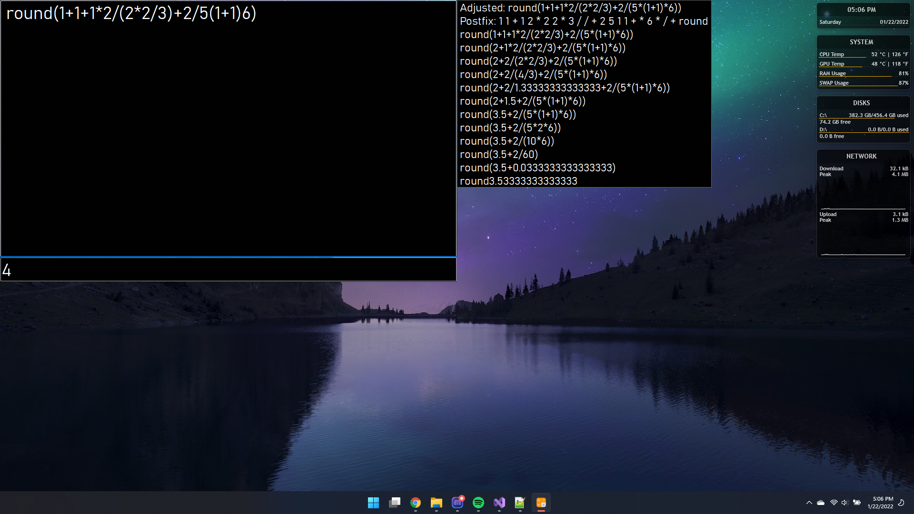
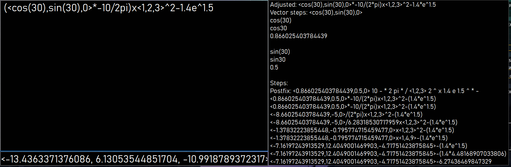

This depends on DecimalExtensions from [KGy SOFT](https://www.nuget.org/packages/KGySoft.CoreLibraries/6.0.1?_src=template)

This isn't really a user-ready product. I made it to replace the calculator that opens when I press the calculator button on my keyboard and didn't plan on releasing it but it was requested.  
  
This calculator supports order of operations, parentheses, and vectors. Supported operators are +, -, \*, /, %, ^, x (cross product), and . (dot product). Vectors are formatted like <1,2,3> but can have equations in them too. Multiplying 2 vectors with \* will produce a new vector as <x1\*x2,y1\*y2,z1\*z2>.  
Supported functions are sin, cos, tan, asin, acos, atan, deg (converts radians to degrees, same as \* 180 / pi), rad (converts degrees to radians, same as \* pi / 180), abs, floor, ceil, round, and sqrt (square root).  
Supported constants are pi and e.  
Vectors work with all operators and functions.  
  
Variables can also be used. Just type in the format of `a=1+2`. Each line is a new equation. Variable names can overwrite existing operator and constant names. Useful for if you want to use the variable name "x" and won't be needing to do cross product.  
  
Uses the highly precise decimal datatype instead of float or double to minimize precision loss.
  
It also doesn't have any window controls like minimizing or closing because it was made to be used with AutoHotkey. Opening the program again while it's already running will close it. Unless you set that up you will have to close and minimize it via the taskbar.  
Really this is just here for the source code.  

The AutoHotkey script I'm using is this
```
#NoEnv
SendMode Input
SetWorkingDir %A_ScriptDir%

Launch_App2::
    run C:\Users\jacob\source\repos\Calculator\bin\Release\Calculator.exe
    return
```
  
  
  
  


Todo list:
* Add syntax checking beore calculating
* <strike>Add variable support</strike>
* <strike>Switch to using decimal type for more precision</strike>
